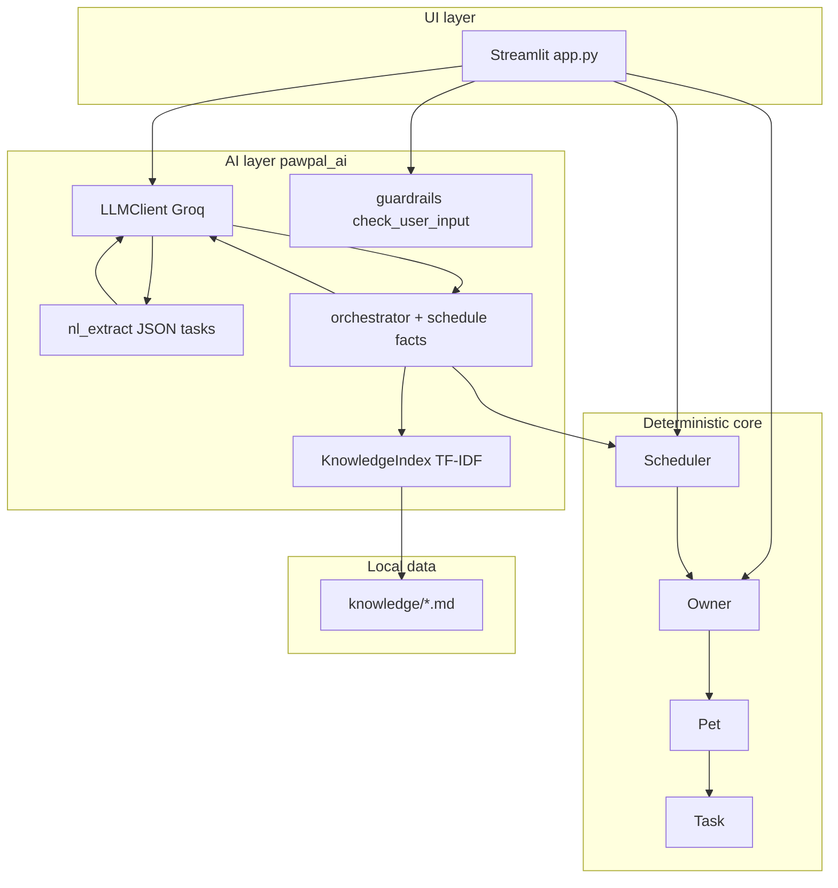

# PawPal+

**PawPal+** is a pet-care planner with deterministic scheduling and optional **Groq**-powered AI (natural-language tasks, RAG, agentic Q&A, guardrails).

> **Not veterinary advice.** PawPal+ does not replace a veterinarian.

---

## Original project (Codepath Modules 1–3)

This work extends the **Codepath AI Engineering Module 2 PawPal starter** (the “show” track aligned with Modules 1–3).

**What that starter provided:** a small **Streamlit** app backed by Python domain classes—**`Owner`**, **`Pet`**, **`Task`**, and **`Scheduler`**—so learners could model a multi-pet household, attach tasks to pets, and produce a **priority-ordered daily plan** with a simple **time-budget check** against the owner’s available hours. The emphasis was on clear object structure and transparent scheduling logic, not on cloud AI.

**What you see in this repo** is that core, **plus** the extensions below—so reviewers can run one app and see both the deterministic “spine” and the AI layer.

---

## Title & summary — what this project does and why it matters

**PawPal+** helps busy pet owners **see what needs doing**, **prioritize** when time is tight, and optionally **describe tasks in plain English** or **ask scheduling questions** with answers grounded in their own plan and a small local handbook (**RAG** over `knowledge/*.md`).

It matters because it combines **predictable rules** (sorting, validation) with **assistive AI** where the value is real—but only after **guardrails** and explicit “not medical advice” positioning, which mirrors how production assistants should treat regulated domains.

---

## Architecture overview

The system splits into **three layers**:

1. **UI** — `app.py` (Streamlit): tabs for **Household**, **My Schedule**, **Ask PawPal**; session state holds `Owner`, `Scheduler`, and a `KnowledgeIndex`.
2. **Deterministic core** — `pawpal_system.py`: tasks live on each `Pet`; `Scheduler` builds `daily_plans` and runs `validate_schedule()` against `Owner.available_hours`.
3. **AI layer** — `pawpal_ai/`: **`LLMClient`** (Groq/OpenAI-compatible API), **`KnowledgeIndex`** (TF-IDF retrieval), **`guardrails.check_user_input`**, **`nl_extract`** (paragraph → JSON tasks), **`orchestrator.run_agentic_assistant`** (tool-style loop with schedule facts + retrieval).

**Diagrams (source of truth for boxes and arrows):**

- **[`assets/ARCHITECTURE.md`](assets/ARCHITECTURE.md)** — Mermaid **component** diagram and **data-flow** charts (Ask PawPal, NL extraction, core scheduling).
- **[`assets/class_diagram.mmd`](assets/class_diagram.mmd)** — UML-style **class relationships** for `Owner` / `Pet` / `Task` / `Scheduler`.

### System architecture diagram (high level)

The component view below matches [`assets/ARCHITECTURE.md`](assets/ARCHITECTURE.md); that file also documents data-flow charts for Ask PawPal, NL extraction, and core scheduling.



In words: **user input** hits **guardrails** first; safe prompts may call **Groq** with **retrieved chunks** and **schedule facts**; the UI never stores API keys in the repo (`.env` + optional sidebar overrides).

More detail on what is deterministic vs model-driven: [`docs/AI_DECISIONS.md`](docs/AI_DECISIONS.md).

---

## Setup instructions

From a clone of this repository, use the **`PawPal App`** directory (contains `app.py` and `requirements.txt`).

**Prerequisites:** Python **3.10+**, a free **[Groq](https://console.groq.com/)** API key for AI features (core app and tests run without live calls where mocked).

### 1. Clone and virtual environment

```powershell
git clone https://github.com/Deek9399/AI_PawPal.git
cd AI_PawPal
cd "PawPal App"
python -m venv .venv
.\.venv\Scripts\activate
pip install -r requirements.txt
```

macOS / Linux: `python3 -m venv .venv` then `source .venv/bin/activate`.

### 2. Environment variables

```powershell
copy .env.example .env
```

Edit **`.env`** and set at least:

| Variable | Purpose |
|----------|---------|
| `GROQ_API_KEY` | Required for live AI (or use `OPENAI_API_KEY`) |
| `OPENAI_BASE_URL` | Default `https://api.groq.com/openai/v1` |
| `OPENAI_MODEL` | e.g. `llama-3.1-8b-instant` |

Aliases supported in code: **`GROQ_MODEL`**, **`GROQ_BASE_URL`** (see `pawpal_ai/config.py`).

### 3. Run the app

```powershell
streamlit run app.py
```

Optional: override key/model in the **sidebar** for demos (session only).

### 4. Run tests

```bash
python -m pytest
```

Most tests use **mocks**—no network required for CI-style runs.

---

## Demo walkthrough

The end-to-end screen recording covers **Household** (including natural-language task entry), **My Schedule** (building today’s plan and metrics), **Ask PawPal** with schedule facts and handbook retrieval, and a **guardrail** refusal with no LLM call. The same flows are shown step by step in **Sample interactions** below.

**Loom:** [Watch the walkthrough](https://www.loom.com/share/5dc52d19884f47fda681737b8675fc31)

---


## Sample interactions (inputs + example outputs)

*Build **today’s plan** under **My Schedule** before Ask PawPal examples so metrics and context exist. Use **demo data** on first load, or **Settings → Demo → Reload sample household**.*

### 1) Ask PawPal — scheduling tradeoff

**Input (Ask PawPal tab):**

```text
How should I prioritize if I only have an hour?
```

**Illustrative model output** (exact wording varies by model and plan):

```text
With only 60 minutes, focus on the highest-priority items in your built plan first—anything rated 5 before 4—and treat lower-priority grooming or optional tasks as “if time remains.” If your plan already exceeds 60 minutes total, trim one lower-priority task’s duration in Household or move it to another day rather than rushing everything.
```

### 2) Ask PawPal — “what first today”

**Input:**

```text
What should I do first today?
```

**Illustrative model output:**

```text
Based on your today’s plan, start with the first unchecked item in priority order—typically feeding or medication if those are marked highest priority—then work down the list. Use the checklist in My Schedule to mark items done as you go so the plan stays honest for tomorrow.
```

*With **Let PawPal use your plan and retrieved tips** enabled, schedule facts are included in the answer.*

### 3) Describe tasks with AI — paragraph in

**Input (Household → Describe tasks with AI):**

```text
For Mochi I need a 20-minute morning walk every day and feeding twice daily—both high priority.
```

**Typical UI outcome (not free-form prose):** success banner such as **“Added 2 task(s).”** (or similar), with new rows under **Your pets** / task lists; warnings appear if a pet name does not match.

### 4) Guardrail — blocked before the LLM (deterministic “output”)

**Input (Ask PawPal or NL box):**

```text
diagnose my cat's skin rash
```

**Actual system output** (from `pawpal_ai.guardrails`; no Groq call):

```text
PawPal+ cannot diagnose medical conditions. If you are worried about your pet's health, please contact a licensed veterinarian.
```

---

## Design decisions & trade-offs

- **Priority-only scheduling** — `schedule_daily_plan` sorts pending tasks by priority instead of solving a full timetabling optimization. **Why:** transparent behavior and easy debugging for a course-scale codebase. **Trade-off:** does not auto-space walks across the day or respect “morning only” preferences without future work.
- **Tasks on `Pet`, not embedded `pet` on `Task`** — ownership is explicit per pet list. **Trade-off:** NL extraction must resolve pet names to the right list; the code handles that in `apply_tasks_to_pets`.
- **RAG over local Markdown** — no vector DB to deploy; TF-IDF in `KnowledgeIndex`. **Trade-off:** retrieval quality is simpler than embeddings + Pinecone, but it is reproducible and cheap for demos.
- **Guardrails before every LLM path** — small regex/rule set for diagnosis/dosing/emergency language. **Trade-off:** not exhaustive vs a full moderation API, but it is testable and zero-latency overhead.

Deeper rationale: [`docs/AI_DECISIONS.md`](docs/AI_DECISIONS.md).

---

## Testing summary — reliability & what we measured

Reliability is checked in **three** complementary ways (no separate numeric “confidence score” from the model—the stack relies on **tests + logs + human review** instead):

| Approach | What it covers |
|----------|----------------|
| **Automated tests** | `pytest`: scheduler, recurrence, validation, guardrails, JSON extraction, RAG index load, **mocked** agent rounds (`tests/`). |
| **Logging & errors** | `logging` in `app.py` (e.g. NL extract / Ask PawPal failures) and `pawpal_ai/*` (API errors, retrieval warnings, JSON retry paths) so failures are recorded with context. |
| **Human evaluation** | Manual walkthrough of Household, My Schedule, and Ask PawPal with the demo household and a valid API key; spot-check of guardrail refusals vs safe scheduling questions. |

**Reliability snapshot (one read):** *19 of 19* automated tests passed; the NL extraction path is the noisiest in practice (models sometimes wrap JSON), but `_parse_json_loose` and tests for fenced JSON keep regressions visible. Logs surface extract and assistant exceptions instead of failing silently. In manual review, answers were most reliable when the schedule and handbook retrieval had something to ground on—ambiguous or empty household context produced weaker or generic replies.

---

**What worked**

- **Pytest split** between `tests/test_pawpal.py` (scheduler, tasks, validation) and `tests/test_pawpal_ai.py` (guardrails, JSON parsing, retrieval smoke, **mocked** `LLMClient.chat` for the agent) gave fast feedback without burning API quota.
- **Guardrail tests** (`diagnose…` blocked vs scheduling question allowed) caught regressions when touch-moving the NL or Ask PawPal entry points.
- **`_parse_json_loose`** tests for markdown-fenced JSON mirrored real model quirks.

**What was fragile**

- Models occasionally returned **non-JSON** or fenced JSON for extraction—handled with stripping and user-visible errors, but still a support burden in demos.
- **Streamlit `cwd`** vs repo root for `.env`—fixed by loading `.env` from the package parent in `pawpal_ai/config.py`.

**What I learned**

- **Test the boundaries you own** (sorting, validation, guardrails) aggressively; **mock the network** for the rest so CI stays green.
- A little **instrumentation** (trace objects in the AI layer) pays off when an answer “looks wrong” but is actually missing schedule context.

Run: `python -m pytest` (see `tests/` for cases).

---

## Reflection — AI, problem-solving, and employability

Building PawPal+ reinforced that **AI is an accelerator, not an architect**: Copilot-style tools were excellent for boilerplate, tests, and Streamlit patterns, but they happily suggested structures (e.g., time-keyed dicts of tasks) that fought the **starter’s `Scheduler` model**. The useful skill was **stating invariants** (“tasks belong to pets,” “plans are ordered lists”) and rejecting suggestions that broke them.

The codebase is split so the deterministic core (`pawpal_system.py`), AI layer (`pawpal_ai/`), and UI (`app.py`) stay easy to navigate. The hardest part was not prompts—it was **clear failure UX** (parse errors, overschedule warnings, guardrail refusals) so users never mistake the app for a vet.

**Topics covered:**

| Topic | Summary |
|-------|---------|
| **Limitations / biases** | RAG and TF‑IDF only reflect `knowledge/`; guardrails are heuristic; scheduling is priority-based, not clinical; English-first session app. |
| **Misuse & prevention** | Could be misused as informal medical advice or to stress APIs; mitigations include disclaimers, guardrails, grounded answers, tests, logging, and secrets only via `.env`. |
| **Surprises in testing** | Mocked tests stayed green while live LLM output still varied; NL extraction’s “creative” JSON shapes mattered more than I expected. |
| **AI collaboration** | **Helpful:** draft pytest for validation/conflicts. **Flawed:** time-keyed task dicts—incompatible with the starter’s `Scheduler` / pet-owned tasks. |

**[`model_card.md`](model_card.md)** — collaboration, biases, misuse, and testing (structured). **[`reflection.md`](reflection.md)** — full narrative, including limitations, misuse, reliability, and AI collaboration (§6).

---

## Project layout

| Path | Role |
|------|------|
| `app.py` | Streamlit UI |
| `pawpal_system.py` | Owner, Pet, Task, Scheduler |
| `pawpal_ai/` | Groq client, RAG, guardrails, orchestrator, NL extract |
| `knowledge/` | Markdown for TF-IDF retrieval |
| `tests/` | Pytest suite |
| `assets/` | Architecture diagrams, class diagram, demo screenshot ([`assets/README.md`](assets/README.md)) |
| `docs/AI_DECISIONS.md` | Deterministic vs AI behavior |
| `docs/VIDEO_WALKTHROUGH.md` | Demo coverage (Household, schedule, Ask PawPal, guardrails) |
| `model_card.md` | Collaboration, biases, misuse, testing |
| `reflection.md` | Extended reflection |

---

## Demo screenshot

Main Streamlit UI (Household, My Schedule, Ask PawPal):

<a href="assets/demo-screenshot.png" target="_blank"></a>

*Static capture; live UI matches the flows described in **Sample interactions**.*
