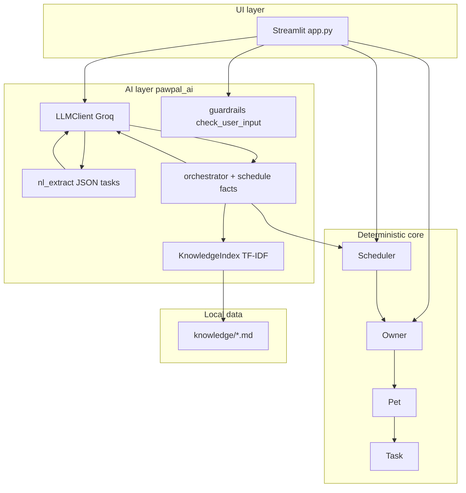
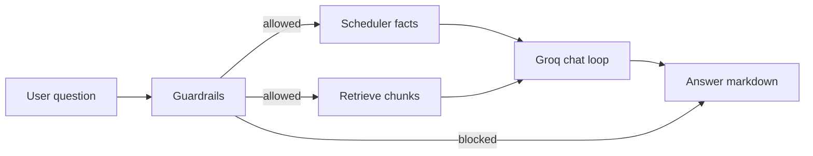
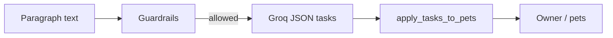
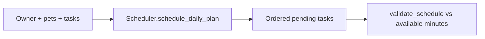

# PawPal+ architecture

This document matches the implementation in `app.py`, `pawpal_system.py`, and `pawpal_ai/`. Diagrams render on GitHub and in many Markdown viewers that support Mermaid.

## Major components

## End-to-end data flow

### Ask PawPal (agent + RAG)

Blocked prompts short-circuit with a fixed safety message (no LLM call).

### Describe tasks with AI (NL extraction)

### Core scheduling (no LLM)

## OO model (domain classes)

See [`class_diagram.mmd`](class_diagram.mmd) for `Owner`, `Pet`, `Task`, `Scheduler` relationships. Tasks live on each `Pet`; `Scheduler` reads pending tasks across pets and stores daily plan lists keyed by day label.

## Class diagram vs runtime AI

`class_diagram.mmd` focuses on **persistent domain objects**. Runtime AI pieces (`LLMClient`, `KnowledgeIndex`, orchestrator) are **stateless services** invoked from `app.py` and do not appear as fields on `Owner`/`Scheduler`.
